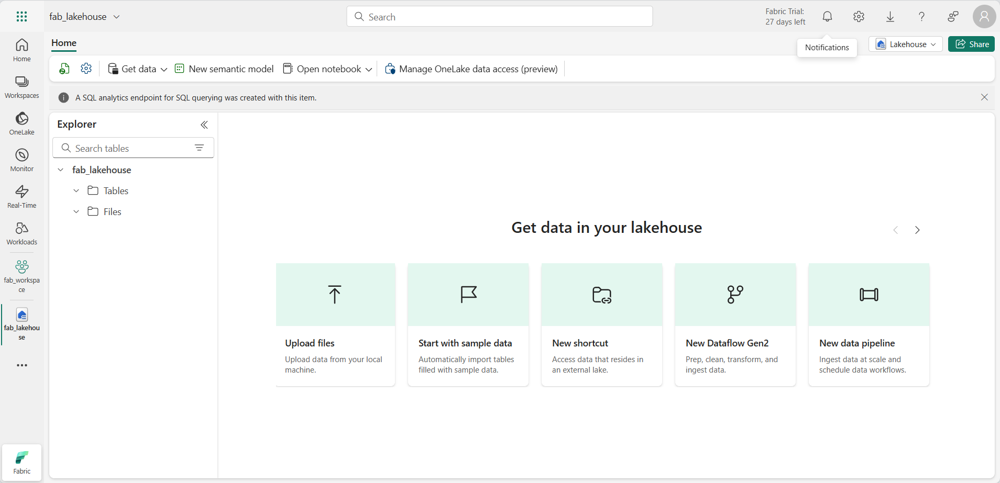
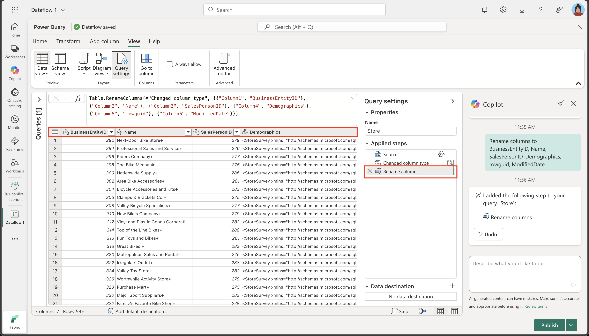
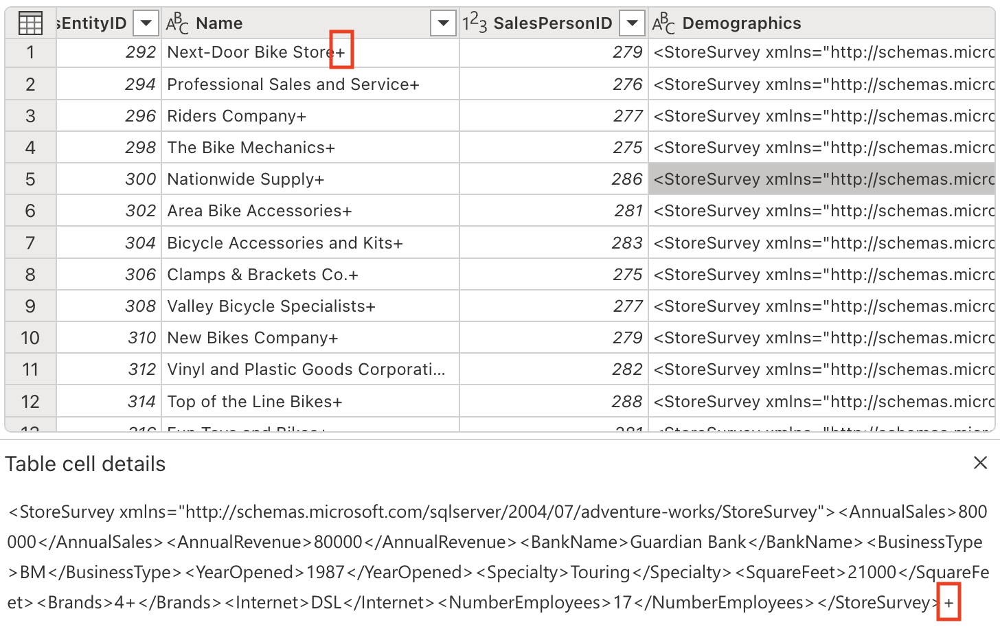
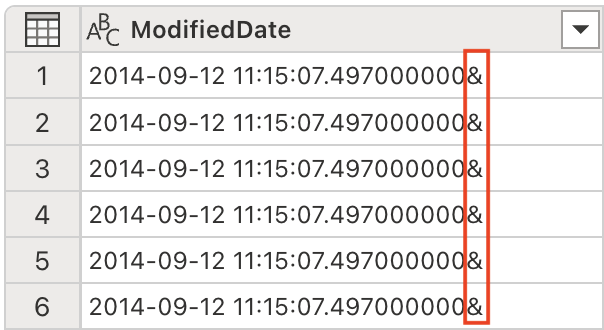
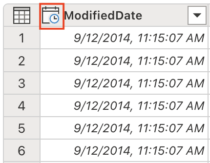
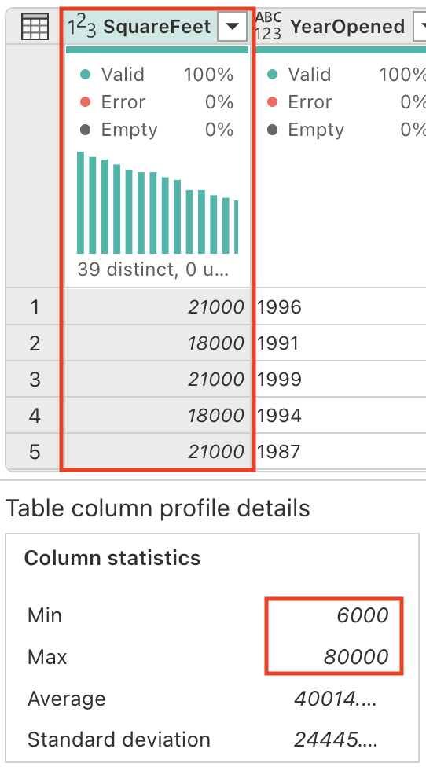

---
lab:
    title: 'Work smarter with Copilot in Microsoft Fabric Dataflow Gen2'
    module: 'Get started with Copilot in Fabric for data engineering'
---

# Work smarter with Copilot in Microsoft Fabric Dataflow Gen2

In Microsoft Fabric, Dataflows (Gen2) connect to various data sources and perform transformations in Power Query Online. They can then be used in Data Pipelines to ingest data into a lakehouse or other analytical store, or to define a dataset for a Power BI report. This lab provides an introduction to Copilot in Dataflows (Gen2) rather than focusing on building a complex enterprise solution.

This exercise should take approximately **30** minutes to complete.

## What you’ll learn

By completing this lab, you will:

- Understand how to use Copilot in Microsoft Fabric Dataflow Gen2 to accelerate data transformation tasks.
- Learn how to ingest, clean, and transform data using Power Query Online with Copilot assistance.
- Apply best practices for data quality, including renaming columns, removing unwanted characters, and setting appropriate data types.
- Gain experience in parsing and expanding XML data within a dataflow.
- Categorize continuous data into meaningful groups for analysis.
- Publish transformed data to a lakehouse and validate the results.
- Recognize the value of AI-assisted data engineering for improving productivity and data quality.

## Before you start

You need a [Microsoft Fabric Capacity (F2 or higher)](https://learn.microsoft.com/fabric/fundamentals/copilot-enable-fabric) with Copilot enabled to complete this exercise.

## Exercise scenario

Contoso, a global retail company, is modernizing its data infrastructure using Microsoft Fabric. As a data engineer, you are tasked with preparing store information for analytics. The raw data is stored in a CSV file and includes embedded XML fields, inconsistent column names, and unwanted characters. Your goal is to use Copilot in Dataflow Gen2 to ingest, clean, transform, and enrich this data—making it ready for reporting and analysis in the lakehouse. This hands-on exercise will guide you through each step, demonstrating how Copilot accelerates and simplifies common data engineering tasks.

## Create a workspace

Before working with data in Fabric, create a workspace with Fabric enabled. A workspace serves as a container for all your Fabric items and provides collaboration capabilities for teams.

1. Navigate to the [Microsoft Fabric home page](https://app.fabric.microsoft.com/home?experience=fabric) at `https://app.fabric.microsoft.com/home?experience=fabric` in a browser, and sign in with your Fabric credentials.

1. In the menu bar on the left, select **Workspaces** (the icon looks similar to &#128455;).

1. Create a new workspace with a name of your choice, selecting a licensing mode that includes Fabric capacity (*Premium*, or *Fabric*). Note that *Trial* is not supported.

    > **Important**: Copilot features in Fabric require a paid capacity (F2 or higher). Trial workspaces don't support Copilot functionality.

1. When your new workspace opens, it should be empty.

    

## Create a lakehouse

Now that you have a workspace, it's time to create a data lakehouse into which you'll ingest data.

1. On the menu bar on the left, select **Create**. In the *New* page, under the *Data Engineering* section, select **Lakehouse**. Give it a unique name of your choice.

    >**Note**: If the **Create** option is not pinned to the sidebar, you need to select the ellipsis (**...**) option first.

    After a minute or so, a new empty lakehouse will be created.

    

## Create a Dataflow (Gen2) to ingest data

Now that you have a lakehouse, you need to ingest some data into it. One way to do this is to define a dataflow that encapsulates an *extract, transform, and load* (ETL) process.

1. In the home page for your workspace, select **Get data** > **New Dataflow Gen2**. After a few seconds, the Power Query editor for your new dataflow opens as shown here.

    

1. Select **Import from a Text/CSV file**, and create a new data source with the following settings:

   - **Link to file**: *Selected*
   - **File path or URL**: `https://raw.githubusercontent.com/MicrosoftLearning/mslearn-fabric/refs/heads/main/Allfiles/Labs/22a/Store.csv`
   - **Connection**: Create new connection
   - **data gateway**: (none)
   - **Authentication kind**: Anonymous
   - **Privacy Level**: None

1. Select **Next** to preview the file data, and then **Create** the data source. The Power Query editor shows the data source and an initial set of query steps to format the data, as shown here:

    

1. On the **Home** ribbon tab, from inside the **Insights** group, select **Copilot**, as shown here:
    
    

1. The column names are currently too generic and lack clear meaning (likely showing as Column1, Column2, etc.). Meaningful column names are crucial for data understanding and downstream processing. Use the following prompt to refine them and ensure they convey the intended information accurately:

    ```copilot-prompt
    Rename columns to BusinessEntityID, Name, SalesPersonID, Demographics, rowguid, ModifiedDate
    ```

    Take note that the column names are now accurate and descriptive. Furthermore, an additional step has been incorporated into the Applied Steps list, showing how Copilot automatically generates Power Query M code behind the scenes:
    
    

1. Certain columns contain a '+' character at the end of their text values. This is a common data quality issue that can interfere with data analysis and processing downstream. 

    
    
    Let's eliminate these unwanted characters using the following prompt:
    
    ```copilot-prompt
    Delete the last character from the columns Name, Demographics, rowguid
    ```
    
    **Why this matters**: Removing extraneous characters ensures data consistency and prevents issues when performing string operations or data joins later in the process.

1. The table contains some redundant columns that need to be removed to streamline our dataset and improve processing efficiency. Use the following prompt to refine the data accordingly:

    
    
    ```copilot-prompt
    Remove the rowguid and Column7 columns
    ```
    
    **Note**: The `rowguid` column is typically used for internal database operations and isn't needed for analysis. `Column7` appears to be an empty or irrelevant column that adds no value to our dataset.
    
1. The Demographics column includes an invisible Unicode character, the Byte Order Mark (BOM) \ufeff, which interferes with XML data parsing. We need to remove it to ensure proper processing. Enter the following prompt in the Copilot pane:

    ```copilot-prompt
    Remove the Byte Order Mark (BOM) \ufeff from the Demographics column
    ```
    
    **Understanding BOM**: The Byte Order Mark is a Unicode character that can appear at the beginning of text files to indicate the byte order of the text encoding. While useful for file encoding detection, it can cause issues when parsing structured data like XML.
    
    Notice the formula that was generated to remove the character:
    
    
    
1. We are now prepared to parse the XML data and expand it into separate columns. The Demographics column contains XML-formatted data that holds valuable store information like annual sales, square footage, and other business metrics.

    
    
    Enter the following prompt in the Copilot pane:
    
    ```copilot-prompt
    Parse this XML and expand it's columns
    ```
    
    **Understanding XML parsing**: XML (eXtensible Markup Language) is a structured data format commonly used to store hierarchical information. By parsing and expanding the XML, we convert nested data into a flat, tabular structure that's easier to analyze.
    
    Notice new columns have been added to the table (you might need to scroll to the right).
    
    

1. Remove the Demographics column, as we no longer need it since we've extracted all the valuable information into separate columns. Enter the following prompt in the Copilot pane:

    ```copilot-prompt
    Remove the Demographics column.
    ```

    **Why remove this column**: Now that we've parsed the XML and created individual columns for each piece of information, the original Demographics column containing the raw XML is redundant and can be safely removed to keep our dataset clean.

1. The ModifiedDate column has an ampersand (&) at the end of its values. It needs to be removed before parsing to ensure proper data processing.

    
    
    Enter the following prompt in the Copilot pane:
    
    ```copilot-prompt
    Remove the last character from the ModifiedDate
    ```

1. We are now ready to convert its data type to DateTime for proper date/time operations and analysis. Enter the following prompt in the Copilot pane:

    ```copilot-prompt
    Set the data type to DateTime
    ```

    **Data type importance**: Converting to the correct data type is crucial for enabling proper sorting, filtering, and date-based calculations in downstream analysis.

    Notice the ModifiedDate data type has changed to DateTime:
    
    
    
1. Adjust the data types of several columns to numeric values to enable mathematical operations and proper aggregations. Enter the following prompt in the Copilot pane:

    ```copilot-prompt
    Set the data type to whole number for the following columns: AnnualSales, AnnualRevenue, SquareFeet, NumberEmployee
    ```
    
    **Why convert to numbers**: Having numeric data types allows for proper mathematical calculations, aggregations (sum, average, etc.), and statistical analysis that wouldn't be possible with text-based data.
    
1. The SquareFeet field holds numerical values ranging from 6,000 to 80,000. Creating categorical groupings from continuous numeric data is a common analytical technique that makes data easier to interpret and analyze.

    
    
    Let's generate a new column to categorize the store size accordingly. Enter the following prompt in the Copilot pane:
    
    ```copilot-prompt
    Add a column StoreSize, based on the SquareFeet:
        0 - 10000: Small
        10001 - 40000: Medium
        40001 - 80000: Large
    ```
    
    Notice a new column StoreSize has been added, with a formula based on the SquareFeet column. Notice also the column profile has the 3 distinct values: Small, Medium, and Large.
    
    
    
1. Modify the data types of columns that currently lack a specified type. Enter the following prompt in the Copilot pane:

    ```copilot-prompt
    Set the datatype of the following columns to text: Name, BankName, BusinessType, YearOpened, Specialty, Brands, Internet, StoreSize
    ```
    
    **Data type consistency**: Explicitly setting data types ensures predictable behavior in downstream processes and prevents automatic type inference that might lead to unexpected results.
    
## Code explanation

1. We've performed several transformations. Let's request Copilot to summarize the steps we've taken:

    ```copilot-prompt
    Describe this query
    ```
    
    Observe that the result appears in the Copilot pane. Below is an example of the explanation provided. Your results might vary slightly as AI-generated content can have mistakes.
    
    
    
    *Here's an explanation for **Store**: Load and transform a CSV file, parse XML data, and categorize stores by size.*
    
    - _**Source**: Load a CSV file from a URL with a pipe delimiter and specific encoding._
    - _**Changed column type**: Change the data types of the columns._
    - _**Rename columns**: Rename the columns to meaningful names._
    - _**Custom**: Remove the last character from the "Name", "Demographics", and "rowguid" columns._
    - _**Remove columns**: Remove the "rowguid" and "Column7" columns._
    - _**Custom 1**: Remove any leading special characters from the "Demographics" column._
    - _**Custom 2**: Parse the "Demographics" column as XML and expand it into multiple columns._
    - _**Remove columns 1**: Remove the original "Demographics" column._
    - _**Transform columns**: Remove the last character from the "ModifiedDate" column._
    - _**Transform columns 1**: Convert the "ModifiedDate" column to datetime type._
    - _**Change type**: Change the data types of the "AnnualSales", "AnnualRevenue", "SquareFeet", and "NumberEmployees" columns to integer._
    - _**Conditional column**: Add a new column "StoreSize" based on the "SquareFeet" value, categorizing stores as "Small", "Medium", or "Large"._
    - _**Change type 1**: Change the data types of several columns to text._
    
## Add data destination for Dataflow

1. On the toolbar ribbon, select the **Home** tab. Then in the **Add data destination** drop-down menu, select **Lakehouse**.

    > **Note:** If this option is grayed out, you may already have a data destination set. Check the data destination at the bottom of the Query settings pane on the right side of the Power Query editor. If a destination is already set, you can change it using the gear.

1. In the **Connect to data destination** dialog box, edit the connection and sign in using your Power BI organizational account to set the identity that the dataflow uses to access the lakehouse.

    

1. Select **Next** and in the list of available workspaces, find your workspace and select the lakehouse you created in it at the start of this exercise. Then specify a new table named **Store**:

    

1. Select **Next** and on the **Choose destination settings** page, disable the **Use automatic settings** option, select **Append** and then **Save settings**.

    > **Note:** We suggest using the *Power query* editor for updating data types, but you can also do so from this page, if you prefer.

    

1. Select **Save & run** to publish the dataflow. Then wait for the **Dataflow 1** dataflow to be created in your workspace.

## Validate your work

Now it's time to validate the ETL process from the dataflow and ensure all transformations were applied correctly.

1. Navigate back to your workspace and open the lakehouse you created earlier.

1. In the lakehouse, locate and open the **Store** table. (You might need to wait a few minutes before it gets populated as the dataflow processes the data.)

1. Observe the following key aspects of your transformed data:

   - **Column names**: Verify they match the meaningful names you specified (BusinessEntityID, Name, SalesPersonID, etc.)
   - **Data types**: Check that numeric columns show as numbers, DateTime columns show as date/time, and text columns show as text
   - **Data quality**: Confirm that unwanted characters (+, &) have been removed
   - **XML expansion**: Notice the individual columns that were extracted from the original XML Demographics data
   - **StoreSize categorization**: Verify the Small/Medium/Large categories were created correctly based on SquareFeet values
   - **Data completeness**: Ensure no critical data was lost during the transformation process

   

    **Why this matters**: The final table should contain clean, well-structured data with meaningful column names, appropriate data types, and the new StoreSize categorical column. This demonstrates how Copilot can help transform raw, messy data into a clean, analysis-ready dataset.

## Clean up resources

If you've finished exploring dataflows in Microsoft Fabric, you can delete the workspace you created for this exercise.

1. Navigate to Microsoft Fabric in your browser.
1. In the bar on the left, select the icon for your workspace to view all of the items it contains.
1. Select **Workspace settings** and in the **General** section, scroll down and select **Remove this workspace**.
1. Select **Delete** to delete the workspace.

