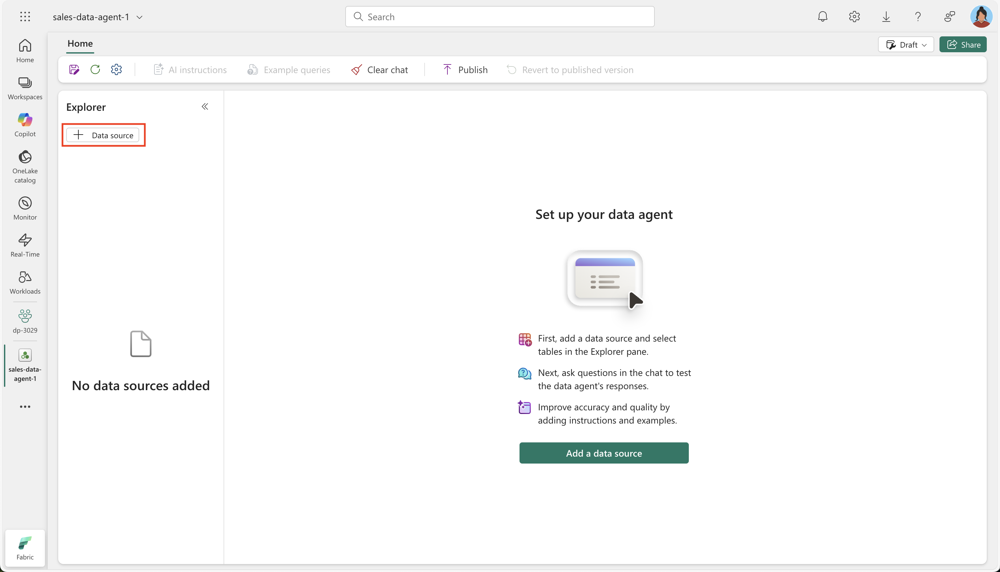
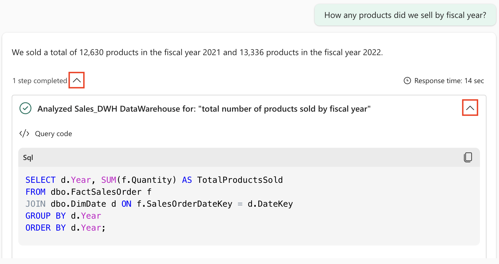

---
lab:
    title: 'Chat with your data using Microsoft Fabric data agents'
    module: 'Implement Fabric Data Agents'
---

# Chat with your data using Microsoft Fabric data agents

A Microsoft Fabric data agent enables natural interaction with your data by allowing you to ask questions in plain English and receive structured, human-readable responses. By eliminating the need to understand query languages like SQL (Structured Query Language), DAX (Data Analysis Expressions), or KQL (Kusto Query Language), the data agent makes data insights accessible across the organization, regardless of technical skill level.

This exercise should take approximately **30** minutes to complete.

## What you’ll learn

By completing this lab, you will:

- Understand the purpose and benefits of Microsoft Fabric data agents for natural language data analysis.
- Learn how to create and configure a Fabric workspace and data warehouse.
- Gain hands-on experience loading and exploring a star schema sales dataset.
- See how data agents translate plain English questions into SQL queries.
- Develop skills to ask effective analytical questions and interpret AI-generated results.
- Build confidence in leveraging AI tools to democratize data access and insights.

## Before you start

You need a [Microsoft Fabric Capacity (F2 or higher)](https://learn.microsoft.com/fabric/fundamentals/copilot-enable-fabric) with Copilot enabled to complete this exercise.

## Exercise scenario

In this exercise, we will create a sales data warehouse, load some data into it and then create a Fabric data agent. We will then ask it a variety of questions and explore how the data agent translates natural language into SQL queries to provide insights. This hands-on approach will demonstrate the power of AI-assisted data analysis without requiring deep SQL knowledge. Let's start!

## Create a workspace

Before working with data in Fabric, create a workspace with Fabric enabled. A workspace in Microsoft Fabric serves as a collaborative environment where you can organize and manage all your data engineering artifacts including lakehouses, notebooks, and datasets. Think of it as a project folder that contains all the resources needed for your data analysis.

1. Navigate to the [Microsoft Fabric home page](https://app.fabric.microsoft.com/home?experience=fabric) at `https://app.fabric.microsoft.com/home?experience=fabric` in a browser, and sign in with your Fabric credentials.

1. In the menu bar on the left, select **Workspaces** (the icon looks similar to &#128455;).

1. Create a new workspace with a name of your choice, selecting a licensing mode that includes Fabric capacity (*Premium*, or *Fabric*). Note that *Trial* is not supported.
   
   > **Why this matters**: Copilot requires a paid Fabric capacity to function. This ensures you have access to the AI-powered features that will help generate code throughout this lab.

41 When your new workspace opens, it should be empty.


## Create a data warehouse

Now that you have a workspace, it's time to create a data warehouse. A data warehouse is a centralized repository that stores structured data from various sources, optimized for analytical queries and reporting. In our case, we'll create a simple sales data warehouse that will serve as the foundation for our data agent interactions. Locate the shortcut to create a new warehouse:

1. On the menu bar on the left, select **Create**. In the *New* page, under the *Data Warehouse* section, select **Warehouse**. Give it a unique name of your choice.

    >**Note**: If the **Create** option is not pinned to the sidebar, you need to select the ellipsis (**...**) option first.

    After a minute or so, a new warehouse will be created:


## Create tables and insert data

A warehouse is a relational database in which you can define tables and other objects. To make our data agent useful, we need to populate it with sample sales data. The script we'll run creates a typical data warehouse schema with dimension tables (containing descriptive attributes) and a fact table (containing measurable business events). This star schema design is optimized for analytical queries that the data agent will generate.

1. On the **Home** menu tab, use the **New SQL Query** button to create a new query. Then copy and paste the Transact-SQL code from `https://raw.githubusercontent.com/MicrosoftLearning/mslearn-fabric/refs/heads/main/Allfiles/Labs/22d/create-dw.txt` into the new query pane.

   > **What this script does**: The script creates a complete sales data warehouse with customer information, product details, date dimensions, and sales transactions. This realistic dataset will allow us to ask meaningful business questions to our data agent.

1. Run the query, which creates a simple data warehouse schema and loads some data. The script should take around 30 seconds to run.

1. Use the **Refresh** button on the toolbar to refresh the view. Then in the **Explorer** pane, verify that the **dbo** schema in the data warehouse now contains the following four tables:
    - **DimCustomer** - Contains customer information including names, locations, and contact details
    - **DimDate** - Contains date-related attributes like fiscal years, quarters, and months for time-based analysis
    - **DimProduct** - Contains product information including names, categories, and pricing
    - **FactSalesOrder** - Contains the actual sales transactions linking customers, products, and dates

    > **Tip**: If the schema takes a while to load, just refresh the browser page.

## Create a Fabric data agent

A Fabric data agent is an AI-powered assistant that can understand natural language questions about your data and automatically generate the appropriate queries to answer them. This eliminates the need for users to know SQL, KQL or DAX syntax while still providing accurate, data-driven insights. Let's create and configure our data agent:

1. Create a new data agent.
   

1. Give it a name like **`sales-data-agent`**.

   > **Why naming matters**: A descriptive name helps you and your team understand the purpose and scope of this data agent, especially when managing multiple agents for different data domains.

   

1. Select **Add a data source**. 

   

1. Choose the data warehouse you created earlier.

   > **Connecting to your data**: The data agent needs access to your tables to understand the schema and relationships. This allows it to generate accurate SQL queries based on your questions.

1. Expand the data warehouse, and check **DimCustomer**, **DimDate**, **DimProduct** and **FactSalesOrder**.

   > **Table selection strategy**: By selecting all four tables, we're giving the data agent access to the complete data model. This enables it to answer complex questions that span multiple tables, such as sales trends by customer location or product performance over time.

   

## Ask questions

Now is the time to start experimenting and ask questions to our data agent. This section demonstrates how natural language can be transformed into SQL queries, making data analysis accessible to users without technical SQL knowledge. Each question will show you both the answer and the underlying query that was generated.

1. Ask a question by typing in the following prompt: 

```copilot-prompt
How many products did we sell by fiscal year?
```

Note the resulting answer: We sold a total of 12,630 products in the fiscal year 2021 and 13,336 products in the fiscal year 2022.

1. Expand the step completed and its substep. This reveals the SQL query that was generated by the data agent in order to answer the question.

   > **Learning opportunity**: By examining the generated SQL, you can understand how the data agent interpreted your question and learn about the underlying data relationships. This transparency builds trust in the AI-generated results.

   

Copilot generated the following SQL code, which might differ slightly depending on your environment and the latest updates to Copilot.

```sql
SELECT d.Year, SUM(f.Quantity) AS TotalProductsSold
FROM dbo.FactSalesOrder f
JOIN dbo.DimDate d ON f.SalesOrderDateKey = d.DateKey
GROUP BY d.Year
ORDER BY d.Year;
```

   > **SQL Explanation**: This query joins the fact table (FactSalesOrder) with the date dimension (DimDate) to group sales by year and sum the quantities. Notice how the data agent automatically understood that "products sold" refers to the Quantity field and "fiscal year" maps to the Year field in the date dimension.

1. Continue with the following question: 

```copilot-prompt
What are the top 10 most popular products all time?
```

   > **What to expect**: This question will demonstrate how the data agent can perform ranking operations, joining product information with sales data to identify bestsellers.

1. Follow up with this question: 

```copilot-prompt
What are the historical trends across all my data?
```

   > **Advanced analytics**: This broader question will show how the data agent can provide trend analysis across multiple dimensions, potentially including time-based patterns in sales, customer behavior, and product performance.

1. Try additional questions to explore different aspects of your data:

```copilot-prompt
In which countries are our customers located?
```

```copilot-prompt
How many products did we sell in the United States?
```

```copilot-prompt
How much revenue did we make in FY 2022?
```

```copilot-prompt
How much was our total sales revenue, by fiscal year, fiscal quarter and month name?
```

   > **Pro tip**: Each of these questions targets different analytical scenarios - geographic analysis, filtered aggregations, revenue calculations, and hierarchical time analysis. Experiment with variations to see how the data agent adapts to different question styles.

## Understanding your data structure

As you experiment with questions, keep these data characteristics in mind to ask more targeted questions:

- **Fiscal year timing**: The fiscal year starts in July (the 7th month). So, Q1 runs from July-September, Q2 from October-December, Q3 from January-March, and Q4 from April-June.

- **Customer identification**: The CustomerAltKey field contains customer email addresses, which can be useful for customer-specific queries.

- **Currency**: All list prices and sales totals are denominated in GBP (British Pounds).

- **Data relationships**: The FactSalesOrder table connects customers, products, and dates through foreign keys, enabling complex multi-dimensional analysis.

> **Experiment further**: Try asking questions that combine these elements, such as "What was our revenue in Q1 of FY 2022?" or "Which customers in the UK bought the most expensive products?" The data agent will automatically handle the complex joins and calculations needed to answer these questions.

## Summary

Congratulations! You have successfully:

- **Created a Fabric workspace** and data warehouse with a realistic sales dataset
- **Built and configured a data agent** that can understand natural language questions about your data
- **Experienced AI-powered data analysis** by asking questions in plain English and seeing how they translate to SQL queries
- **Explored various types of analytical questions** from simple aggregations to complex trend analysis

### Key takeaways

- **Democratized data access**: Data agents make analytics accessible to users regardless of their SQL knowledge
- **Transparency and trust**: You can always inspect the generated SQL to understand how questions are answered
- **Natural language flexibility**: The AI can handle variations in phrasing and even minor typos in questions
- **Complex query generation**: The agent automatically handles joins, aggregations, and filters based on natural language input

### Next steps

Consider exploring:
- **Custom instructions**: Add business-specific context to improve the data agent's responses
- **Additional data sources**: Connect more tables or datasets to expand the agent's knowledge
- **Advanced questions**: Try more complex analytical scenarios involving multiple time periods, customer segments, or product categories
- **Integration**: Embed data agent insights into reports, dashboards, or business applications

The Fabric data agent represents a significant step toward making data insights truly accessible across your organization, bridging the gap between data and decision-making.