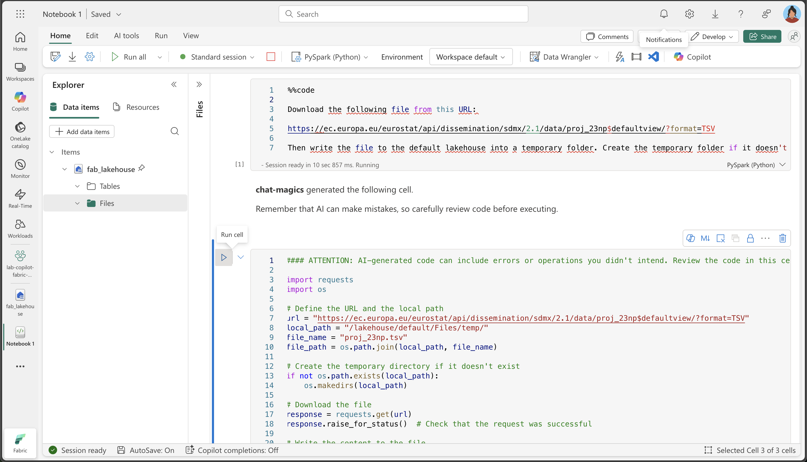
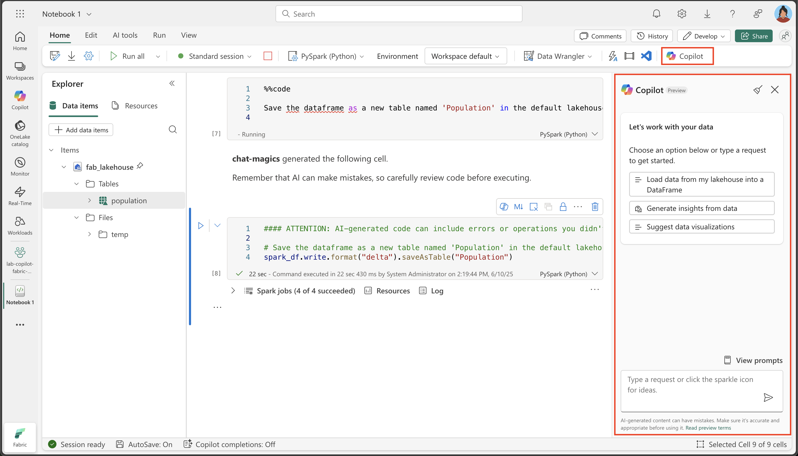
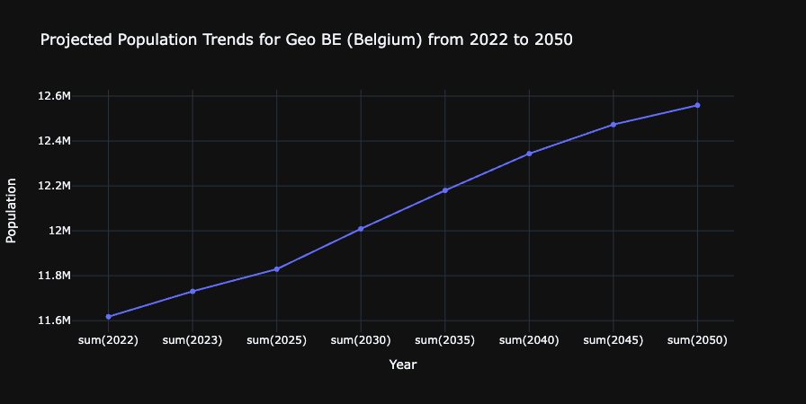

---
lab:
    title: 'Analyze data with Apache Spark and Copilot in Microsoft Fabric notebooks'
    module: 'Get started with Copilot in Fabric for data engineering'
---

# Analyze data with Apache Spark and Copilot in Microsoft Fabric notebooks

In this lab you will use Copilot to ingest data into the Fabric lakehouse and use PySpark to read and analyze the data. 

This lab will take approximately 30 minutes to complete.

> **Note**: You need a [Microsoft Fabric Capacity (F2 or higher)](https://learn.microsoft.com/fabric/fundamentals/copilot-enable-fabric) to complete this exercise.

## Create a workspace

Before working with data in Fabric, create a workspace with the Fabric trial enabled.

1. Navigate to the [Microsoft Fabric home page](https://app.fabric.microsoft.com/home?experience=fabric) at `https://app.fabric.microsoft.com/home?experience=fabric` in a browser, and sign in with your Fabric credentials.
2. In the menu bar on the left, select **Workspaces** (the icon looks similar to &#128455;).
3. Create a new workspace with a name of your choice, selecting a licensing mode that includes Fabric capacity (*Premium*, or *Fabric*). Note that *Trial* is not supported.
4. When your new workspace opens, it should be empty.

    

## Create a lakehouse

Now that you have a workspace, it's time to create a data lakehouse into which you'll ingest data.

1. On the menu bar on the left, select **Create**. In the *New* page, under the *Data Engineering* section, select **Lakehouse**. Give it a unique name of your choice.

    >**Note**: If the **Create** option is not pinned to the sidebar, you need to select the ellipsis (**...**) option first.

    After a minute or so, a new empty lakehouse will be created.

    

## Create a notebook

You can now create a Fabric notebook to work with your data. Notebooks provide an interactive environment where you can write and run code.

1. On the menu bar on the left, select **Create**. In the *New* page, under the *Data Engineering* section, select **Notebook**.

    A new notebook named **Notebook 1** is created and opened.

    

1. Fabric assigns a name to each notebook you create, such as Notebook 1, Notebook 2, etc. Click the name panel above the **Home** tab on the menu to change the name to something more descriptive.

1. Select the first cell (which is currently a code cell), and then in the top-right tool bar, use the **M↓** button to convert it to a markdown cell. The text contained in the cell will then be displayed as formatted text.
1. Use the 🖉 (Edit) button to switch the cell to editing mode, then modify the markdown as shown below.

    ```markdown
   # Explore Eurostat population data.
   Use this notebook to explore population data from Eurostat
    ```

    

When you have finished, click anywhere in the notebook outside of the cell to stop editing it.

## Attach the lakehouse to your notebook

1. Select your new workspace from the left bar. You will see a list of items contained in the workspace including your lakehouse and notebook.
1. Select the lakehouse to display the Explorer pane.
1. From the top menu, select **Open notebook**, **Existing notebook**, and then open the notebook you created earlier. The notebook should now be open next to the Explorer pane. Expand Lakehouses, and expand the Files list. Notice there are no table or files listed yet next to the notebook editor, like this:

    


## Load data

1. Create a new cell in your notebook and copy the following instruction into it. To indicate that we want Copilot to generate code, use `%%code` as the first instruction in the cell. 

```
%%code

Download the following file from this URL:

https://ec.europa.eu/eurostat/api/dissemination/sdmx/2.1/data/proj_23np$defaultview/?format=TSV
 
Then write the file to the default lakehouse into a temporary folder. Create the temporary folder if it doesn't exist yet.
```

1. Select ▷ **Run cell** to the left of the cell to run the code.

Copilot generates the following code, which might differ slightly depending on your environment and the latest updates to Copilot.



Here's the full code:

```python
#### ATTENTION: AI-generated code can include errors or operations you didn't intend. Review the code in this cell carefully before running it.

import urllib.request
import os

# Step 1: Download the file
url = "https://ec.europa.eu/eurostat/api/dissemination/sdmx/2.1/data/proj_23np$defaultview/?format=TSV"
file_path = "/tmp/proj_23np_defaultview.tsv"

urllib.request.urlretrieve(url, file_path)

# Step 2: Create a temporary folder in the default lakehouse
lakehouse_temp_folder = "/lakehouse/default/Files/temp"
os.makedirs(lakehouse_temp_folder, exist_ok=True)

# Step 3: Write the file to the lakehouse temporary folder
import shutil
shutil.move(file_path, os.path.join(lakehouse_temp_folder, "proj_23np.tsv"))

print(f"File successfully written to {os.path.join(lakehouse_temp_folder, 'proj_23np.tsv')}")
```

1. Select ▷ **Run cell** to the left of the cell to run the code and observe the output. The file should be downloaded and saved in the temporary folder of your Lakehouse.


1. Now, create a new cell in your notebook and copy the following instruction into it.

```
%%code

Load the file 'Files/temp/proj_23np.tsv' into a spark dataframe.

The fields are separated with a tab.

Show the contents of the DataFrame using display method.
```

1. Select ▷ **Run cell** to the left of the cell to run the code and observe the output. The dataframe should contain the data from the TSV file. Here's an example of what the generated code might look like:

```python
#### ATTENTION: AI-generated code can include errors or operations you didn't intend. Review the code in this cell carefully before running it.

# Load the file 'Files/temp/proj_23np.tsv' into a spark dataframe.
# The fields have been separated with a tab.
file_path = "Files/temp/proj_23np.tsv"

spark_df = spark.read.format("csv").option("delimiter", "\t").option("header", "true").load(file_path)

# Show the contents of the DataFrame using display method
display(spark_df)
```

Here's an example of what the output might look like:

| freq,projection,sex,age,unit,geo\TIME_PERIOD |      2022  |      2023  |   ...  |      2100  |
| -------------------------------------------- | ---------- | ---------- | ------ | ---------- |
|                         A,BSL,F,TOTAL,PER,AT |   4553444  |   4619179  |   ...  |   4807661  |
|                         A,BSL,F,TOTAL,PER,BE |   5883978  |   5947528  |   ...  |   6331785  |
|                         A,BSL,F,TOTAL,PER,BG |   3527626  |   3605059  |   ...  |   2543673  |
|                                          ... |       ...  |       ...  |   ...  |   5081250  |
|                         A,BSL,F,TOTAL,PER,CY |    463622  |    476907  |   ...  |    504781  |

## Transform data

Let's now go ahead and transform the data. We need to make sure the first field is split into separate columns. Additionally, we also need to make sure to work with correct data types and apply filtering. 

1. Create a new cell in your notebook and copy the following instruction into it.

```
%%code
- Now transform this dataframe spark_df and split the first field 'freq,projection,sex,age,unit,geo\TIME_PERIOD' using a comma into 6 separate fields.
- Then, remove the fields 'freq', 'age', 'unit'.
- The fields 'projection', 'sex', 'geo' should be positioned first.
- The 'projection' field contains codes that should be replaced with the following values:
    _'BSL' -> 'Baseline projections'.
    _'LFRT' -> 'Sensitivity test: lower fertility'.
    _'LMRT' -> 'Sensitivity test: lower mortality'.
    _'HMIGR' -> 'Sensitivity test: higher migration'.
    _'LMIGR' -> 'Sensitivity test: lower migration'.
    _'NMIGR' -> 'Sensitivity test: no migration'.
- Filter the 'geo' field and remove values 'EA20' and 'EU27_2020' (these are not countries).
- Filter the 'sex' field and remove 'T' (these are totals).
- Strip spaces from all field names in the dataframe.
- Convert the data type of all the year fields to integer.
- Display (Render) the DataFrame.
```

1. Select ▷ **Run cell** to the left of the cell to run the code and observe the output. Copilot generates code, which might differ slightly depending on your environment and the latest updates to Copilot.

```python
from pyspark.sql.functions import split, col

# Load the file 'Files/temp/proj_23np.tsv' into a spark dataframe.
file_path = "Files/temp/proj_23np.tsv"
spark_df = spark.read.format("csv").option("delimiter", "\t").option("header", "true").load(file_path)

# Split the first field 'freq,projection,sex,age,unit,geo\TIME_PERIOD' into 6 separate fields.
split_col = split(spark_df['freq,projection,sex,age,unit,geo\TIME_PERIOD'], ',')
spark_df = spark_df.withColumn('freq', split_col.getItem(0)) \
                   .withColumn('projection', split_col.getItem(1)) \
                   .withColumn('sex', split_col.getItem(2)) \
                   .withColumn('age', split_col.getItem(3)) \
                   .withColumn('unit', split_col.getItem(4)) \
                   .withColumn('geo', split_col.getItem(5))

# Remove the fields 'freq', 'age', 'unit'
columns_to_drop = ['freq', 'age', 'unit', 'freq,projection,sex,age,unit,geo\TIME_PERIOD']
spark_df = spark_df.drop(*columns_to_drop)

# Reorder the columns, placing 'projection', 'sex', 'geo' first
columns_order = ['projection', 'sex', 'geo']  |  [col for col in spark_df.columns if col not in ['projection', 'sex', 'geo']]
spark_df = spark_df.select(*columns_order)

# Replace projection field codes with values
replace_map = {
    'BSL': 'Baseline projections',
    'LFRT': 'Sensitivity test: lower fertility',
    'LMRT': 'Sensitivity test: lower mortality',
    'HMIGR': 'Sensitivity test: higher migration',
    'LMIGR': 'Sensitivity test: lower migration',
    'NMIGR': 'Sensitivity test: no migration'
}
spark_df = spark_df.replace(replace_map, subset=['projection'])

# Filter the 'geo' field to remove values 'EA20' and 'EU27_2020'
spark_df = spark_df.filter(~spark_df['geo'].isin(['EA20', 'EU27_2020']))

# Filter the 'sex' field to remove 'T'
spark_df = spark_df.filter(spark_df['sex'] != 'T')

# Strip spaces from all field names
spark_df = spark_df.toDF(*(c.replace(' ', '') for c in spark_df.columns))

# Convert the data type of all the year fields to integer
for column in spark_df.columns:
    if column.isnumeric():
        spark_df = spark_df.withColumn(column, col(column).cast('int'))

# Display the DataFrame
display(spark_df)
```

1. Select ▷ **Run cell** to the left of the cell to run the code and observe the output. Here's an example of what the output might look like:

|          projection|sex|geo|    2022|    2023|     ...|    2100|
|--------------------|---|---|--------|--------|--------|--------| 
|Baseline projections|  F| AT| 4553444| 4619179|     ...| 4807661|
|Baseline projections|  F| BE| 5883978| 5947528|     ...| 6331785|
|Baseline projections|  F| BG| 3527626| 3605059|     ...| 2543673|
|...                 |...|...|     ...|     ...|     ...|     ...|
|Baseline projections|  F| LU|  320333|  329401|     ...|  498954|


>[!TIP]
> You might need to scroll the table to the right to observe all columns.

## Save data

Next, we want to save the transformed data to our lakehouse. 

1. Create a new cell in your notebook and copy the following instruction into it.

```
%%code

Save the dataframe as a new table named 'Population' in the default lakehouse.
```

1. Select ▷ **Run cell** to the left of the cell to run the code. Copilot generates code, which might differ slightly depending on your environment and the latest updates to Copilot.

```python
#### ATTENTION: AI-generated code can include errors or operations you didn't intend. Review the code in this cell carefully before running it.

spark_df.write.format("delta").saveAsTable("Population")
```

1. Select ▷ **Run cell** to the left of the cell to run the code.

## Validation

1. To validate that the data is saved correctly, expand the tables in your Lakehouse and check the contents (you might need to refresh the Tables folder by selecting the three dots ...). 


1. From the Home ribbon, select the Copilot option.



1. Enter the following prompt:

```
What are the projected population trends for geo BE from 2020 to 2050 as a line chart visualization. Use only existing columns from the population table.
```

1. Observe the output generated, which might differ slightly depending on your environment and the latest updates to Copilot. Copy the code fragment into a new cell.

```python
#### ATTENTION: AI-generated code can include errors or operations you didn't intend. Review the code in this cell carefully before running it.

import plotly.graph_objs as go

# Query to get the projected population trends for geo BE from 2022 to 2050
result = spark.sql(
    """
    SELECT `2022`, `2023`, `2025`, `2030`, `2035`,
           `2040`, `2045`, `2050`
    FROM Population
    WHERE geo = 'BE' AND projection = 'Baseline projections'
    """
)
df = result.toPandas()

# Extract data for the line chart
years = df.columns.tolist()
values = df.iloc[0].tolist()

# Create the plot
fig = go.Figure()
fig.add_trace(go.Scatter(x=years, y=values, mode='lines+markers', name='Projected Population'))

# Update layout
fig.update_layout(
    title='Projected Population Trends for Geo BE (Belgium) from 2022 to 2050',
    xaxis_title='Year',
    yaxis_title='Population',
    template='plotly_dark'
)

# Display the plot
fig.show()
```

1. Select ▷ **Run cell** to the left of the cell to run the code. 

Observe the chart it created:



## Clean up resources

In this exercise, you’ve learned how to use Copilot and Spark to work with data in Microsoft Fabric.

If you’ve finished exploring your data, you can end the Spark session and delete the workspace that you created for this exercise.

1.	On the notebook menu, select **Stop session** to end the Spark session.
1.	In the bar on the left, select the icon for your workspace to view all of the items it contains.
1.	Select **Workspace settings** and in the **General** section, scroll down and select **Remove this workspace**.
1.	Select **Delete** to delete the workspace.