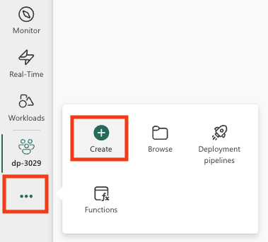
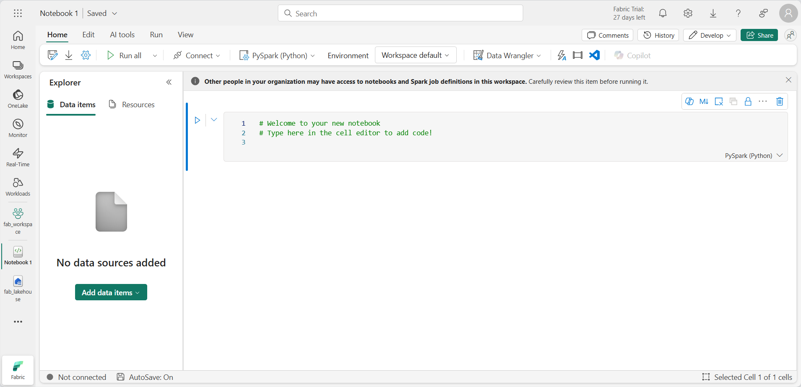
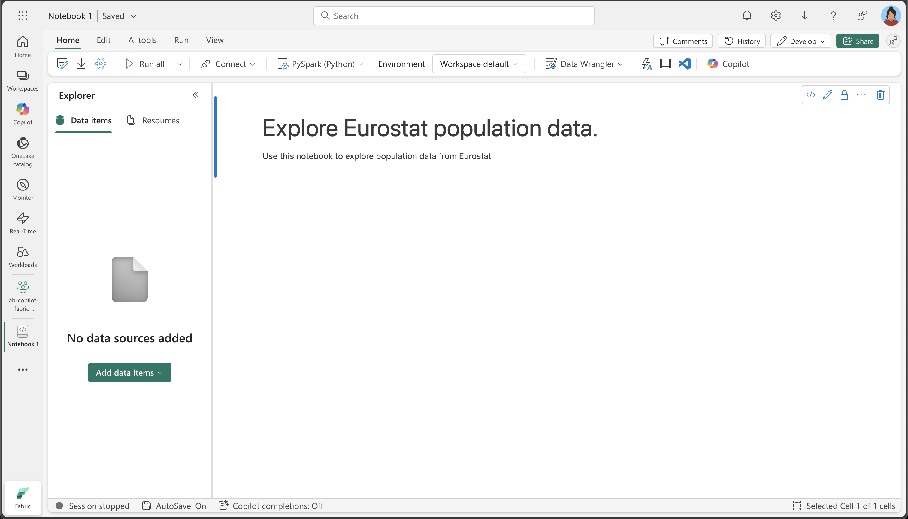
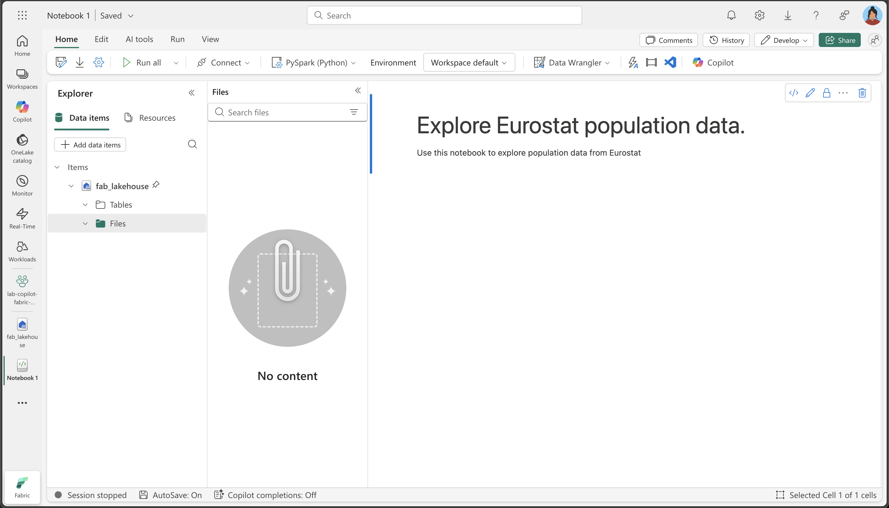
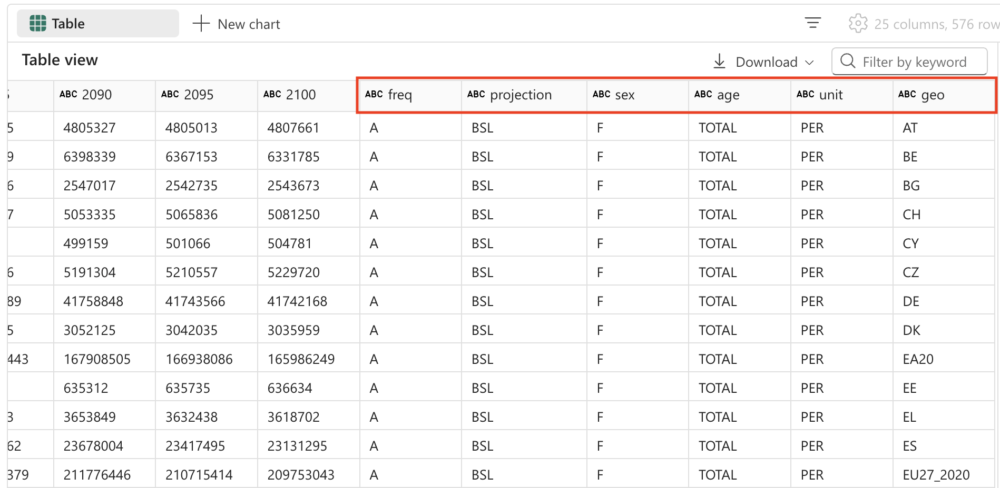
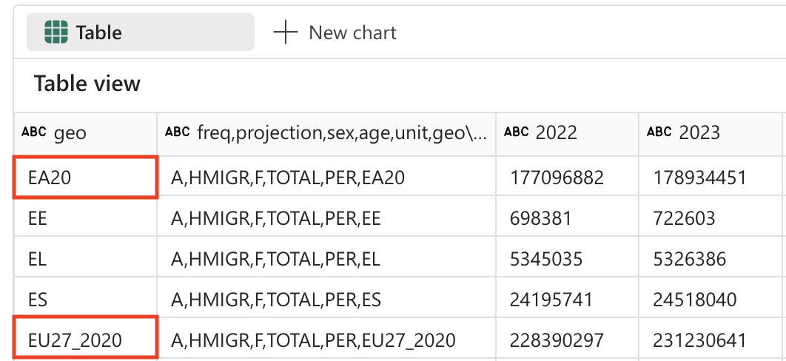
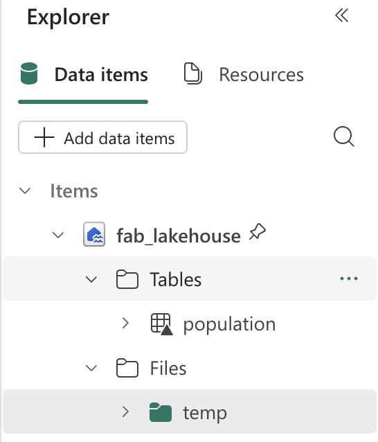

---
lab:
    title: 'Analyze data with Apache Spark and Copilot in Microsoft Fabric notebooks'
    module: 'Get started with Copilot in Fabric for data engineering'
---

# Analyze data with Apache Spark and Copilot in Microsoft Fabric notebooks

In this lab, we use Copilot for Fabric Data Engineering to load, transform, and save data in a Lakehouse, using a notebook. Notebooks provide an interactive environment that combines code, visualizations, and narrative text in a single document. This format makes it easy to document your workflow, explain your reasoning, and share results with others. By using notebooks, you can iteratively develop and test code, visualize data at each step, and keep a clear record of your analysis process. This approach enhances collaboration, reproducibility, and understanding, making notebooks an ideal tool for data engineering and analytics tasks.

Traditionally, working with notebooks for data engineering requires you to write code in languages such as Python or Scala and have a solid understanding of frameworks and libraries like Apache Spark and pandas. This can be challenging for those new to programming or unfamiliar with these tools. With Copilot in Fabric notebooks, you can describe your data tasks in natural language, and Copilot will generate the necessary code for you—handling much of the technical complexity and allowing you to focus on your analysis.

This exercise should take approximately **30** minutes to complete.

## What you’ll learn

By completing this lab, you will be able to:

- Create and configure a Microsoft Fabric workspace and lakehouse for data engineering tasks.
- Use Copilot in Fabric notebooks to generate code from natural language prompts.
- Ingest, clean, and transform data using Apache Spark and Copilot-assisted workflows.
- Normalize and prepare statistical datasets for analysis by splitting, filtering, and converting data types.
- Save transformed data as a table in the lakehouse for downstream analytics.
- Use Copilot to generate queries and visualizations for data exploration and validation.
- Understand best practices for data cleaning, transformation, and collaborative analytics in Microsoft Fabric.

## Before you start

You need a [Microsoft Fabric Capacity (F2 or higher)](https://learn.microsoft.com/fabric/fundamentals/copilot-enable-fabric) with Copilot enabled to complete this exercise.

> **Note**: For your convenience, a notebook with all prompts for this excercise is available to you for download at:

`https://github.com/MicrosoftLearning/mslearn-fabric/raw/refs/heads/main/Allfiles/Labs/23/Starter/eurostat-notebook.ipynb`

## Exercise scenario

Let's imagine Contoso Health, a multi-specialty hospital network, wants to expand its services in the EU and wants to analyze projected population data. This example uses the [Eurostat](https://ec.europa.eu/eurostat/web/main/home) (statistical office of the European Union) population projection dataset.

Source: EUROPOP2023 Population on January 1 by age, sex, and type of projection [[proj_23np](https://ec.europa.eu/eurostat/databrowser/product/view/proj_23np?category=proj.proj_23n)], Last updated June 28, 2023.

## Create a workspace

Before working with data in Fabric, create a workspace with Fabric enabled. A workspace in Microsoft Fabric serves as a collaborative environment where you can organize and manage all your data engineering artifacts including lakehouses, notebooks, and datasets. Think of it as a project folder that contains all the resources needed for your data analysis.

1. Navigate to the [Microsoft Fabric home page](https://app.fabric.microsoft.com/home?experience=fabric) at `https://app.fabric.microsoft.com/home?experience=fabric` in a browser, and sign in with your Fabric credentials.

2. In the menu bar on the left, select **Workspaces** (the icon looks similar to &#128455;).

3. Create a new workspace with a name of your choice, selecting a licensing mode that includes Fabric capacity (*Premium*, or *Fabric*). Note that *Trial* is not supported.
   
   > **Why this matters**: Copilot requires a paid Fabric capacity to function. This ensures you have access to the AI-powered features that will help generate code throughout this lab.

4. When your new workspace opens, it should be empty.

    

## Create a lakehouse

Now that you have a workspace, it's time to create a lakehouse into which you'll ingest data. A lakehouse combines the benefits of a data lake (storing raw data in various formats) with a data warehouse (structured data optimized for analytics). It will serve as both the storage location for our raw population data and the target for our cleaned, transformed dataset.

1. On the menu bar on the left, select **Create**. In the *New* page, under the *Data Engineering* section, select **Lakehouse**. Give it a unique name of your choice.

    >**Note**: If the **Create** option is not pinned to the sidebar, you need to select the ellipsis (**...**) option first.



After a minute or so, a new empty lakehouse will be created.


## Create a notebook

You can now create a Fabric notebook to work with your data. Notebooks provide an interactive environment where you can write and run code, visualize results, and document your data analysis process. They're ideal for exploratory data analysis and iterative development, allowing you to see the results of each step immediately.

1. On the menu bar on the left, select **Create**. In the *New* page, under the *Data Engineering* section, select **Notebook**.

    A new notebook named **Notebook 1** is created and opened.

    

2. Fabric assigns a name to each notebook you create, such as Notebook 1, Notebook 2, etc. Click the name panel above the **Home** tab on the menu to change the name to something more descriptive.


3. Select the first cell (which is currently a code cell), and then in the top-right tool bar, use the **M↓** button to convert it to a markdown cell. The text contained in the cell will then be displayed as formatted text.

   > **Why use markdown cells**: Markdown cells allow you to document your analysis with formatted text, making your notebook more readable and easier to understand for others (or yourself when you return to it later).


4. Use the 🖉 (Edit) button to switch the cell to editing mode, then modify the markdown as shown below.

    ```md
   # Explore Eurostat population data.
   Use this notebook to explore population data from Eurostat
    ```

    

When you have finished, click anywhere in the notebook outside of the cell to stop editing it.

## Attach the lakehouse to your notebook

To work with data in your lakehouse from the notebook, you need to attach the lakehouse to your notebook. This connection allows your notebook to read from and write to the lakehouse storage, creating a seamless integration between your analysis environment and your data storage.

1. Select your new workspace from the left bar. You will see a list of items contained in the workspace including your lakehouse and notebook.

2. Select the lakehouse to display the Explorer pane.

3. From the top menu, select **Open notebook**, **Existing notebook**, and then open the notebook you created earlier. The notebook should now be open next to the Explorer pane. Expand Lakehouses, and expand the Files list. Notice there are no table or files listed yet next to the notebook editor, like this:

    

   > **What you see**: The Explorer pane on the left shows your lakehouse structure. Currently, it's empty, but as we load and process data, you'll see files appearing in the **Files** section and tables in the **Tables** section.


## Load data

Now we'll use Copilot to help us download data from the Eurostat API. Instead of writing Python code from scratch, we'll describe what we want to do in natural language, and Copilot will generate the appropriate code. This demonstrates one of the key benefits of AI-assisted coding: you can focus on the business logic rather than the technical implementation details.

1. Create a new cell in your notebook and copy the following instruction into it. To indicate that we want Copilot to generate code, use `%%code` as the first instruction in the cell. 

   > **About the `%%code` magic command**: This special instruction tells Copilot that you want it to generate Python code based on your natural language description. It's one of several "magic commands" that help you interact with Copilot more effectively.

```plaintext
%%code

Download the following file from this URL:

https://ec.europa.eu/eurostat/api/dissemination/sdmx/2.1/data/proj_23np$defaultview/?format=TSV
 
Then write the file to the default lakehouse into a folder named temp. Create the folder if it doesn't exist yet.
```

2. Select ▷ **Run cell** to the left of the cell to run the code.

Copilot generates the following code, which might differ slightly depending on your environment and the latest updates to Copilot.


> **How Copilot works**: Notice how Copilot translates your natural language request into working Python code. It understands that you need to make an HTTP request, handle the file system, and save the data to a specific location in your lakehouse.

Here's the full code for your convencience, in case you experience exceptions during execution:

```python
#### ATTENTION: AI-generated code can include errors or operations you didn't intend. Review the code in this cell carefully before running it.

import requests
import os

# Define the URL and the local path
url = "https://ec.europa.eu/eurostat/api/dissemination/sdmx/2.1/data/proj_23np$defaultview/?format=TSV"
local_path = "/lakehouse/default/Files/temp/"
file_name = "proj_23np.tsv"
file_path = os.path.join(local_path, file_name)

# Create the temporary directory if it doesn't exist
if not os.path.exists(local_path):
    os.makedirs(local_path)

# Download the file
response = requests.get(url)
response.raise_for_status()  # Check that the request was successful

# Write the content to the file
with open(file_path, "wb") as file:
    file.write(response.content)

print(f"File downloaded and saved to {file_path}")
```

3. Select ▷ **Run cell** to the left of the cell to run the code and observe the output. The file should be downloaded and saved in the temporary folder of your Lakehouse.

> **Note**: you might need to refresh your lakehouse Files by selecting the three dots ...


4. Now, create a new cell in your notebook and copy the following instruction into it.

   > **Next step**: Now that we have the raw data file in our lakehouse, we need to load it into a Spark DataFrame so we can analyze and transform it. A DataFrame is a distributed collection of data organized into named columns, similar to a table in a database or a spreadsheet.

```plaintext
%%code

Load the file 'Files/temp/proj_23np.tsv' into a spark dataframe.

The fields are separated with a tab.

Show the contents of the DataFrame using display method.
```

5. Select ▷ **Run cell** to the left of the cell to run the code and observe the output. The dataframe should contain the data from the TSV file. Here's an example of what the generated code might look like:

```python
#### ATTENTION: AI-generated code can include errors or operations you didn't intend. Review the code in this cell carefully before running it.

# Load the file 'Files/temp/proj_23np.tsv' into a spark dataframe.
# The fields have been separated with a tab.
file_path = "Files/temp/proj_23np.tsv"

spark_df = spark.read.format("csv").option("delimiter", "\t").option("header", "true").load(file_path)

# Show the contents of the DataFrame using display method
display(spark_df)
```

Here's an example of what the output might look like:

| freq,projection,sex,age,unit,geo\TIME_PERIOD |      2022  |      2023  |   ...  |      2100  |
| -------------------------------------------- | ---------- | ---------- | ------ | ---------- |
|                         A,BSL,F,TOTAL,PER,AT |   4553444  |   4619179  |   ...  |   4807661  |
|                         A,BSL,F,TOTAL,PER,BE |   5883978  |   5947528  |   ...  |   6331785  |
|                         A,BSL,F,TOTAL,PER,BG |   3527626  |   3605059  |   ...  |   2543673  |
|                                          ... |       ...  |       ...  |   ...  |   5081250  |
|                         A,BSL,F,TOTAL,PER,CY |    463622  |    476907  |   ...  |    504781  |

> **Understanding the data structure**: Notice that the first column contains multiple values separated by commas (frequency, projection type, sex, age, unit, and geographic location), while the remaining columns represent years with population values. This structure is common in statistical datasets but needs to be cleaned for effective analysis.

## Transform data: split fields

Let's now go ahead and transform the data. We need to make sure the first field is split into separate columns. Additionally, we also need to make sure to work with correct data types and apply filtering. 

> **Why we need to split the fields**: The first column contains multiple pieces of information concatenated together (frequency, projection type, sex, age group, unit, and geographic code). For proper analysis, each of these should be in its own column. This process is called "normalizing" the data structure.

1. Create a new cell in your notebook and copy the following instruction into it.

```plaintext
%%code

Split the first field 'freq,projection,sex,age,unit,geo\TIME_PERIOD' using a comma into 6 separate fields.
```

2. Select ▷ **Run cell** to the left of the cell to run the code and observe the output. Here's an example of what the output might look like:

```python
#### ATTENTION: AI-generated code can include errors or operations you didn't intend. Review the code in this cell carefully before running it.

from pyspark.sql.functions import split, col

# Split the first field 'freq,projection,sex,age,unit,geo\TIME_PERIOD' into 6 separate fields
spark_df = spark_df.withColumn("freq", split(col("freq,projection,sex,age,unit,geo\\TIME_PERIOD"), ",").getItem(0)) \
                   .withColumn("projection", split(col("freq,projection,sex,age,unit,geo\\TIME_PERIOD"), ",").getItem(1)) \
                   .withColumn("sex", split(col("freq,projection,sex,age,unit,geo\\TIME_PERIOD"), ",").getItem(2)) \
                   .withColumn("age", split(col("freq,projection,sex,age,unit,geo\\TIME_PERIOD"), ",").getItem(3)) \
                   .withColumn("unit", split(col("freq,projection,sex,age,unit,geo\\TIME_PERIOD"), ",").getItem(4)) \
                   .withColumn("geo", split(col("freq,projection,sex,age,unit,geo\\TIME_PERIOD"), ",").getItem(5))

# Show the updated DataFrame
display(spark_df)
```

3. Select ▷ **Run cell** to the left of the cell to run the code. You might need to scroll the table to the right to see the new fields added to the table.



## Transform data: remove fields

There are some fields in the table that have no real added value (there is only one distinct value). As a best practice, we need to clean them up and remove them from the dataset.

> **Data cleaning principle**: Columns with only one unique value don't provide analytical value and can make your dataset unnecessarily complex. Removing them simplifies the data structure and improves performance. In this case, 'freq' (frequency), 'age' (all records show TOTAL), and 'unit' (all records show PER for persons) are constant across all rows.

4. Create a new cell in your notebook and copy the following instruction into it.

```plaintext
%%code

Remove the fields 'freq', 'age', 'unit'.
```

5. Select ▷ **Run cell** to the left of the cell to run the code and observe the output. Here's an example of what the output might look like:

```python
#### ATTENTION: AI-generated code can include errors or operations you didn't intend. Review the code in this cell carefully before running it.

# Remove the fields 'freq', 'age', 'unit'
spark_df = spark_df.drop("freq", "age", "unit")

# Show the updated DataFrame
display(spark_df)
```

6. Select ▷ **Run cell** to the left of the cell to run the code.

## Transform data: reposition fields

Organizing your data with the most important identifying columns first makes it easier to read and understand. In data analysis, it's a common practice to position categorical/dimensional columns (like projection type, sex, and geographic location) before the numerical/measure columns (the population values by year).

1. Create a new cell in your notebook and copy the following instruction into it.

```plaintext
%%code

The fields 'projection', 'sex', 'geo' should be positioned first.
```

2. Select ▷ **Run cell** to the left of the cell to run the code and observe the output. Here's an example of what the output might look like:

```python
#### ATTENTION: AI-generated code can include errors or operations you didn't intend. Review the code in this cell carefully before running it.

# Reorder the DataFrame with 'projection', 'sex', 'geo' fields first
new_column_order = ['projection', 'sex', 'geo'] + [col for col in spark_df.columns if col not in {'projection', 'sex', 'geo'}]
spark_df = spark_df.select(new_column_order)

# Show the reordered DataFrame
display(spark_df)
```

3. Select ▷ **Run cell** to the left of the cell to run the code.

## Transform data: replace values

The projection field currently contains cryptic codes that aren't user-friendly. For better readability and analysis, we'll replace these codes with descriptive names that clearly explain what each projection scenario represents.

> **Understanding projection scenarios**: Statistical organizations often use different scenarios to model future population changes. The baseline represents the most likely scenario, while sensitivity tests show how population might change under different assumptions about fertility rates, mortality rates, and migration patterns.

1. Create a new cell in your notebook and copy the following instruction into it.

```plaintext
%%code

The 'projection' field contains codes that should be replaced with the following values:
    _'BSL' -> 'Baseline projections'.
    _'LFRT' -> 'Sensitivity test: lower fertility'.
    _'LMRT' -> 'Sensitivity test: lower mortality'.
    _'HMIGR' -> 'Sensitivity test: higher migration'.
    _'LMIGR' -> 'Sensitivity test: lower migration'.
    _'NMIGR' -> 'Sensitivity test: no migration'.
```

2. Select ▷ **Run cell** to the left of the cell to run the code and observe the output. Here's an example of what the output might look like:

```python
#### ATTENTION: AI-generated code can include errors or operations you didn't intend. Review the code in this cell carefully before running it.

from pyspark.sql.functions import when

# Replace projection codes
spark_df = spark_df.withColumn("projection", 
                               when(spark_df["projection"] == "BSL", "Baseline projections")
                               .when(spark_df["projection"] == "LFRT", "Sensitivity test: lower fertility")
                               .when(spark_df["projection"] == "LMRT", "Sensitivity test: lower mortality")
                               .when(spark_df["projection"] == "HMIGR", "Sensitivity test: higher migration")
                               .when(spark_df["projection"] == "LMIGR", "Sensitivity test: lower migration")
                               .when(spark_df["projection"] == "NMIGR", "Sensitivity test: no migration")
                               .otherwise(spark_df["projection"]))

# Display the updated DataFrame
display(spark_df)
```

3. Select ▷ **Run cell** to the left of the cell to run the code.


## Transform data: filter data

The population projections table contains 2 rows for countries that do not exist: EU27_2020 (*totals for European Union - 27 countries*) and EA20 (*Euro area - 20 countries*). We need to remove these 2 rows, because we want to keep the data only at the lowest grain.

> **Data granularity principle**: For detailed analysis, it's important to work with data at the most granular level possible. Aggregated values (like EU totals) can always be calculated when needed, but including them in your base dataset can lead to double-counting or confusion in analysis.



1. Create a new cell in your notebook and copy the following instruction into it.

```plaintext
%%code

Filter the 'geo' field and remove values 'EA20' and 'EU27_2020' (these are not countries).
```

2. Select ▷ **Run cell** to the left of the cell to run the code and observe the output. Here's an example of what the output might look like:

```python
#### ATTENTION: AI-generated code can include errors or operations you didn't intend. Review the code in this cell carefully before running it.

# Filter out 'geo' values 'EA20' and 'EU27_2020'
spark_df = spark_df.filter((spark_df['geo'] != 'EA20') & (spark_df['geo'] != 'EU27_2020'))

# Display the filtered DataFrame
display(spark_df)
```

3. Select ▷ **Run cell** to the left of the cell to run the code.

The population project table also contains a field 'sex' which contains the following distinct values:

- M: Male
- F: Female
- T: Total (male + female)

Again, we need to remove the totals, so we keep the data at the lowest level of detail.

> **Why remove totals**: Similar to the geographic aggregations, we want to keep only the individual sex categories (Male and Female) and exclude the total values. This allows for more flexible analysis - you can always sum Male and Female values to get totals, but you can't split totals back into components.

4. Create a new cell in your notebook and copy the following instruction into it.

```plaintext
%%code

Filter the 'sex' field and remove 'T' (these are totals).
```

5. Select ▷ **Run cell** to the left of the cell to run the code and observe the output. Here's an example of what the output might look like:

```python
#### ATTENTION: AI-generated code can include errors or operations you didn't intend. Review the code in this cell carefully before running it.

# Filter out 'sex' values 'T'
spark_df = spark_df.filter(spark_df['sex'] != 'T')

# Display the filtered DataFrame
display(spark_df)
```

6. Select ▷ **Run cell** to the left of the cell to run the code.

## Transform data: trim spaces

Some field names in the population projection table have a space at the end. We need to apply a trim operation to the names of these fields.

> **Data quality concern**: Extra spaces in column names can cause issues when querying data or creating visualizations. It's a common data quality issue, especially when data comes from external sources or is exported from other systems. Trimming spaces ensures consistency and prevents hard-to-debug issues later.

1. Create a new cell in your notebook and copy the following instruction into it.

```plaintext
%%code

Strip spaces from all field names in the dataframe.
```

2. Select ▷ **Run cell** to the left of the cell to run the code and observe the output. Here's an example of what the output might look like:

```python
#### ATTENTION: AI-generated code can include errors or operations you didn't intend. Review the code in this cell carefully before running it.

from pyspark.sql.functions import col

# Strip spaces from all field names
spark_df = spark_df.select([col(column).alias(column.strip()) for column in spark_df.columns])

# Display the updated DataFrame
display(spark_df)
```

3. Select ▷ **Run cell** to the left of the cell to run the code.

## Transform data: data type conversion

If we want to properly analyze the data later (using Power BI or SQL for example), we need to make sure the data types (like numbers and datetime) are set correctly. 

> **Importance of correct data types**: When data is loaded from text files, all columns are initially treated as strings. Converting year columns to integers enables mathematical operations (like calculations and aggregations) and ensures proper sorting. This step is crucial for downstream analytics and visualization tools.

1. Create a new cell in your notebook and copy the following instruction into it.

```plaintext
%%code

Convert the data type of all the year fields to integer.
```

2. Select ▷ **Run cell** to the left of the cell to run the code and observe the output. Here's an example of what the output might look like:

```python
#### ATTENTION: AI-generated code can include errors or operations you didn't intend. Review the code in this cell carefully before running it.

from pyspark.sql.functions import col

# Convert the data type of all the year fields to integer
year_columns = [col(column).cast("int") for column in spark_df.columns if column.strip().isdigit()]
spark_df = spark_df.select(*spark_df.columns[:3], *year_columns)

# Display the updated DataFrame
display(spark_df)
```

3. Select ▷ **Run cell** to the left of the cell to run the code. Here's an example of what the output might look like (columns and rows removed for brevity):

|          projection|sex|geo|    2022|    2023|     ...|    2100|
|--------------------|---|---|--------|--------|--------|--------| 
|Baseline projections|  F| AT| 4553444| 4619179|     ...| 4807661|
|Baseline projections|  F| BE| 5883978| 5947528|     ...| 6331785|
|Baseline projections|  F| BG| 3527626| 3605059|     ...| 2543673|
|...                 |...|...|     ...|     ...|     ...|     ...|
|Baseline projections|  F| LU|  320333|  329401|     ...|  498954|

>[!TIP]
> You might need to scroll the table to the right to observe all columns.

## Save data

Next, we want to save the transformed data to our lakehouse. 

> **Why save the transformed data**: After all this data cleaning and transformation work, we want to persist the results. Saving the data as a table in the lakehouse allows us and others to use this clean dataset for various analytics scenarios without having to repeat the transformation process. It also enables other tools in the Microsoft Fabric ecosystem (like Power BI, SQL Analytics Endpoint, and Data Factory) to work with this data.

1. Create a new cell in your notebook and copy the following instruction into it.

```plaintext
%%code

Save the dataframe as a new table named 'Population' in the default lakehouse.
```

2. Select ▷ **Run cell** to the left of the cell to run the code. Copilot generates code, which might differ slightly depending on your environment and the latest updates to Copilot.

```python
#### ATTENTION: AI-generated code can include errors or operations you didn't intend. Review the code in this cell carefully before running it.

spark_df.write.format("delta").saveAsTable("Population")
```

3. Select ▷ **Run cell** to the left of the cell to run the code.

## Validation: ask questions

Now let's explore the power of Copilot for data analysis. Instead of writing complex SQL queries or visualization code from scratch, we can ask Copilot natural language questions about our data and it will generate the appropriate code to answer them.

1. To validate that the data is saved correctly, expand the tables in your Lakehouse and check the contents (you might need to refresh the Tables folder by selecting the three dots ...). 



2. From the Home ribbon, select the Copilot option.

   > **Copilot chat interface**: The Copilot panel provides a conversational interface where you can ask questions about your data in natural language. It can generate code for analysis, create visualizations, and help you explore patterns in your dataset.


3. Enter the following prompt:

```plaintext
What are the projected population trends for geo BE from 2020 to 2050 as a line chart visualization. Use only existing columns from the population table. Perform the query using SQL.
```

   > **What this demonstrates**: This prompt showcases Copilot's ability to understand context (our Population table), generate SQL queries, and create visualizations. It's particularly powerful because it combines data querying with visualization in a single request.

4. Observe the output generated, which might differ slightly depending on your environment and the latest updates to Copilot. Copy the code fragment into a new cell.

```python
#### ATTENTION: AI-generated code can include errors or operations you didn't intend. Review the code in this cell carefully before running it.

import plotly.graph_objs as go

# Query to get the projected population trends for geo BE from 2022 to 2050
result = spark.sql(
    """
    SELECT `2022`, `2023`, `2025`, `2030`, `2035`,
           `2040`, `2045`, `2050`
    FROM Population
    WHERE geo = 'BE' AND projection = 'Baseline projections'
    """
)
df = result.toPandas()

# Extract data for the line chart
years = df.columns.tolist()
values = df.iloc[0].tolist()

# Create the plot
fig = go.Figure()
fig.add_trace(go.Scatter(x=years, y=values, mode='lines+markers', name='Projected Population'))

# Update layout
fig.update_layout(
    title='Projected Population Trends for Geo BE (Belgium) from 2022 to 2050',
    xaxis_title='Year',
    yaxis_title='Population',
    template='plotly_dark'
)

# Display the plot
fig.show()
```

5. Select ▷ **Run cell** to the left of the cell to run the code. 

Observe the chart it created:


> **What you've accomplished**: You've successfully used Copilot to generate a visualization that shows population trends for Belgium over time. This demonstrates the end-to-end data engineering workflow: data ingestion, transformation, storage, and analysis - all with AI assistance.

## Clean up resources

In this exercise, you’ve learned how to use Copilot and Spark to work with data in Microsoft Fabric.

If you’ve finished exploring your data, you can end the Spark session and delete the workspace that you created for this exercise.

1.	On the notebook menu, select **Stop session** to end the Spark session.
2.	In the bar on the left, select the icon for your workspace to view all of the items it contains.
3.	Select **Workspace settings** and in the **General** section, scroll down and select **Remove this workspace**.
4.	Select **Delete** to delete the workspace.