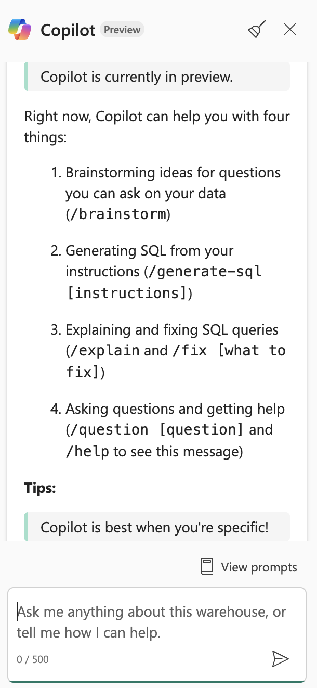
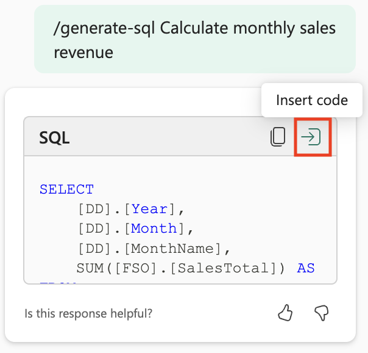
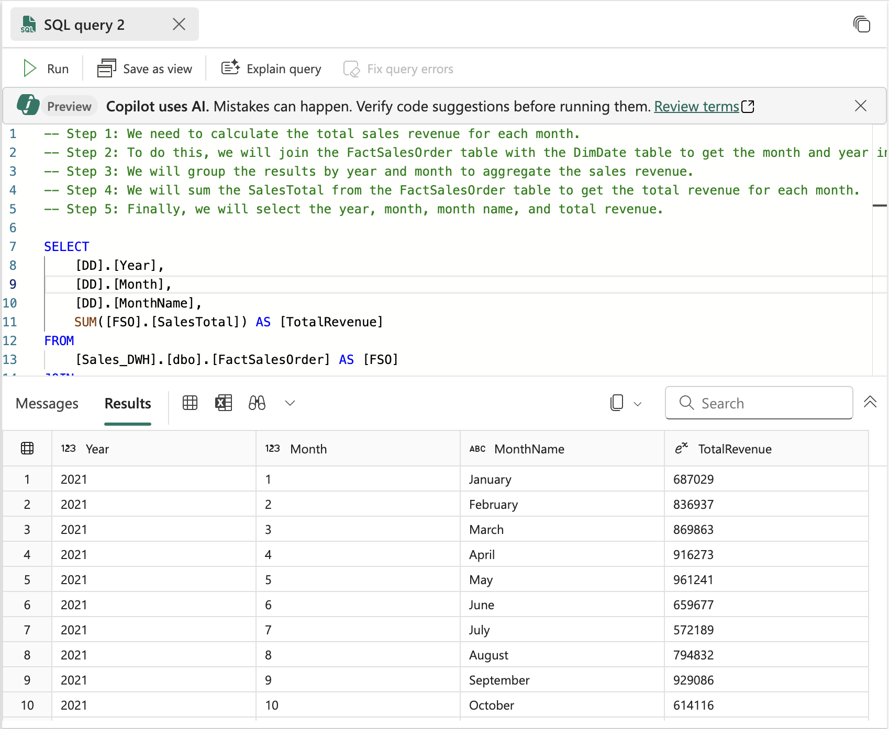
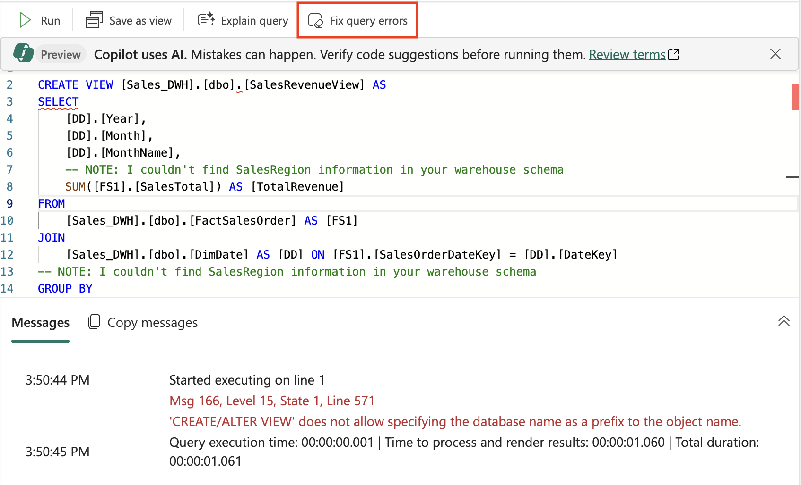

---
lab:
    title: 'Use Copilot in Microsoft Fabric data warehouse'
    module: 'Get started with Copilot in Fabric for Data Warehouse'
---

# Use Copilot in Microsoft Fabric data warehouse

In Microsoft Fabric, a data warehouse provides a relational database for large-scale analytics. Unlike the default read-only SQL endpoint for tables defined in a lakehouse, a data warehouse provides full SQL semantics; including the ability to insert, update, and delete data in the tables. In this lab, we will explore how we can leverage Copilot to create SQL Queries.

This lab will take approximately **30** minutes to complete.

> **Note**: You need a [Microsoft Fabric Capacity (F2 or higher)](https://learn.microsoft.com/fabric/fundamentals/copilot-enable-fabric) with Copilot enabled to complete this exercise.

## Create a workspace

Before working with data in Fabric, create a workspace with the Fabric trial enabled.

1. Navigate to the [Microsoft Fabric home page](https://app.fabric.microsoft.com/home?experience=fabric) at `https://app.fabric.microsoft.com/home?experience=fabric` in a browser, and sign in with your Fabric credentials.
1. In the menu bar on the left, select **Workspaces** (the icon looks similar to &#128455;).
1. Create a new workspace with a name of your choice, selecting a licensing mode that includes Fabric capacity (*Trial*, *Premium*, or *Fabric*).
1. When your new workspace opens, it should be empty.

    

## Create a data warehouse

Now that you have a workspace, it's time to create a data warehouse. The Synapse Data Warehouse home page includes a shortcut to create a new warehouse:

1. On the menu bar on the left, select **Create**. In the *New* page, under the *Data Warehouse* section, select **Warehouse**. Give it a unique name of your choice.

    >**Note**: If the **Create** option is not pinned to the sidebar, you need to select the ellipsis (**...**) option first.

    After a minute or so, a new warehouse will be created:

    

## Create tables and insert data

A warehouse is a relational database in which you can define tables and other objects.

1. On the **Home** menu tab, use the **New SQL Query** button to create a new query. Then copy and paste the Transact-SQL code from `https://raw.githubusercontent.com/MicrosoftLearning/dp-data/main/create-dw.txt` into the new query pane.
1. Run the query, which creates a simple data warehouse schema and loads some data. The script should take around 30 seconds to run.
1. Use the **Refresh** button on the toolbar to refresh the view. Then in the **Explorer** pane, verify that the **dbo** schema in the data warehouse now contains the following four tables:
    - **DimCustomer**
    - **DimDate**
    - **DimProduct**
    - **FactSalesOrder**

    > **Tip**: If the schema takes a while to load, just refresh the browser page.

## Query data warehouse tables

Since the data warehouse is a relational database, you can use SQL to query its tables. Working with Copilot makes it even faster to generate SQL queries!

1. Close the current **SQL Query 1**.
1. From the Home ribbon, select the Copilot option.


1. Let’s start by exploring what Copilot can do. Click on the suggestion labeled `What can Copilot do?` and send it as your prompt.

Read the output and observe Copilot is currently in preview and can help with brainstorming, generating SQL queries, explain and fix queries, etc.



1. We're aiming to analyze sales revenue by month. Enter the following prompt and send it.

```plaintext
/generate-sql Calculate monthly sales revenue
```

1. Review the output that was generated, which might differ slightly depending on your environment and the latest updates to Copilot. 

1. Select the **Insert Code** icon located at the top-right corner of the query.



1. Execute the query by selecting the ▷ **Run** option above the query and observe the output.



1. Create a **New SQL Query**, and ask a follow-up question to also include the month name and sales region in the results:

```plaintext
/generate-sql Retrieves sales revenue data grouped by year, month, month name and sales region
```

1. Select the **Insert Code** icon and ▷ **Run** the query. Observe the output it returns.

1. Let's create a view from this query by asking Copilot the following question:

```plaintext
/generate-sql Create a view in the dbo schema that shows sales revenue data grouped by year, month, month name and sales region
```

1. Select the **Insert Code** icon and ▷ **Run** the query. Review the output it generates. 

The query does not execute successfully because the SQL statement includes the database name as a prefix, which is not allowed in the data warehouse when defining a view.

1. Select the **Fix query errors** option. Observe how Copilot makes corrections to the query.



Here's an example of the query it corrected - notice the `Auto-Fix` comments.

```sql
-- Auto-Fix: Removed the database name prefix from the CREATE VIEW statement
CREATE VIEW [dbo].[SalesRevenueView] AS
SELECT 
    [DD].[Year],
    [DD].[Month],
    [DD].[MonthName],
    -- NOTE: I couldn't find SalesRegion information in your warehouse schema
    SUM([FS1].[SalesTotal]) AS [TotalRevenue]
FROM 
    [dbo].[FactSalesOrder] AS [FS1] -- Auto-Fix: Removed the database name prefix
JOIN 
    [dbo].[DimDate] AS [DD] ON [FS1].[SalesOrderDateKey] = [DD].[DateKey] -- Auto-Fix: Removed the database name prefix
-- NOTE: I couldn't find SalesRegion information in your warehouse schema
GROUP BY 
    [DD].[Year],
    [DD].[Month],
    [DD].[MonthName]; 
```

1. Enter another prompt to Retrieve a detailed product listing, organized by category. For each product category, it should display the available products along with their list prices and rank them within their respective categories based on price. 

```plaintext
/generate-sql Retrieve a detailed product listing, organized by category. For each product category, it should display the available products along with their list prices and rank them within their respective categories based on price. 
```

1. Select the **Insert Code** icon and ▷ **Run** the query. Observe the output it returns.

This allows for easy comparison of products within the same category, helping identify the most and least expensive items.

## Clean up resources

In this exercise, you have created a data warehouse that contains multiple tables. You used Copilot to generate SQL queries to analyze data in the data warehouse.

If you've finished exploring your data warehouse, you can delete the workspace you created for this exercise.

1. In the bar on the left, select the icon for your workspace to view all of the items it contains.
2. In the **...** menu on the toolbar, select **Workspace settings**.
3. In the **General** section, select **Remove this workspace**.
